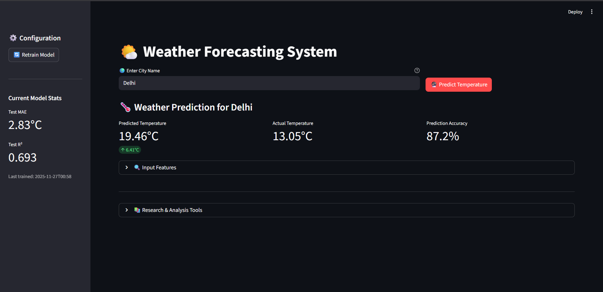
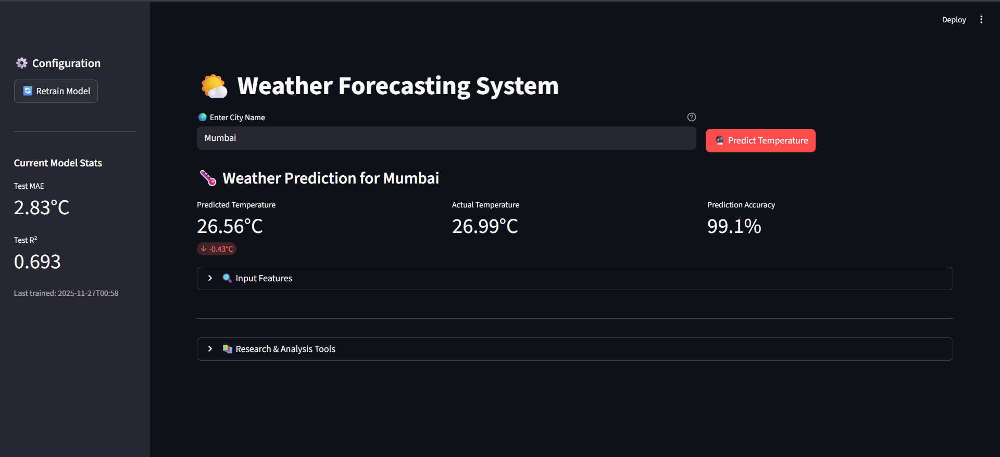
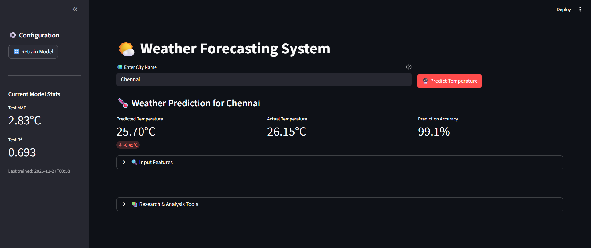

# 🌤️ Weather Forecast

A machine-learning powered weather prediction system built with Python, scikit-learn, and Streamlit. The model learns from historical weather data (multi-city, India-focused) and predicts temperature in real-time using live data from the OpenWeatherMap API.

---

## Table of contents

- [Project Structure](#project-structure)
- [Features](#features)
  - [Machine Learning](#machine-learning)
  - [Model Evaluation](#model-evaluation)
  - [Real-Time Weather API](#real-time-weather-api)
  - [Streamlit Web App](#streamlit-web-app)
- [Screenshots](#screenshots)
- [Setup & Installation](#setup--installation)
- [Usage](#usage)
- [Notes & Limitations](#notes--limitations)
- [Future Improvements](#future-improvements)
- [Logs & Models](#logs--models)
- [License](#license)

---

## Project Structure

```
Weather Forecast/
│── WeatherForecast.py        # Main ML + Streamlit application
│── weather_data.csv          # Historical weather dataset
│── .env                      # API key (ignored in git)
│── .gitignore                # Ignored files
│── README.md                 # Project documentation
│── requirements.txt          # Python dependencies
│── models/                   # Trained model + metrics
│── logs/                     # Runtime logs
```

---

## Features

### 🧠 Machine Learning
- Random Forest Regression
- Full preprocessing pipeline
  - Missing value handling
  - One-Hot Encoding
  - Standard Scaling
  - Seasonal (cyclical) encodings (e.g., sin/cos for hour/day)
  - Interaction features

### 📊 Model Evaluation
- Train / Test split
- MAE, RMSE, R² reporting
- 5-Fold Cross-Validation
- Metrics logging and saving

### 🌐 Real-Time Weather API
- OpenWeatherMap integration for live current weather
- Retry logic and response validation
- Extracts humidity, pressure, wind speed, temperature, etc.

### 🖥️ Streamlit Web App
- Simple UI to:
  - Enter a city name
  - Fetch current weather
  - Get predicted temperature
  - View full model metrics and logs
- Retrain the model from the app when needed

---


## Screenshots

### 🌍 Weather Prediction — Delhi  


### 🌍 Weather Prediction — Mumbai  


### 🌍 Weather Prediction — Chennai  


### 🌍 Weather Prediction — Ahmedabad


## Setup & Installation

1. Clone the repository
```bash
git clone https://github.com/FlamerFx/Weather-Forecast.git
cd Weather-Forecast
```

2. Create a virtual environment (Windows example)
```bash
python -m venv venv
venv\Scripts\activate
```
(Unix/macOS)
```bash
python3 -m venv venv
source venv/bin/activate
```

3. Install dependencies
```bash
pip install -r requirements.txt
```

4. Add your OpenWeatherMap API key  
Create a `.env` file in the project root (this file is ignored by git):
```
API_KEY=YOUR_OPENWEATHERMAP_API_KEY
```

---

## Usage

Start the Streamlit app:
```bash
streamlit run WeatherForecast.py
```

UI workflow:
- Enter a city name
- Click "Fetch current weather" to pull live features
- Click "Get predicted temperature" to view the model prediction
- Open the metrics panel to see evaluation results
- Use the retrain option to retrain the model with updated data

---

## Logs & Models

- Trained models and their metrics are saved to the `models/` directory.
- Runtime logs (API calls, prediction attempts, training steps) are saved to `logs/` for troubleshooting and audit.

---

## Notes & Limitations

- Predictions are based on historical patterns found in the dataset — accuracy depends heavily on dataset quality and coverage.
- Real-world weather can deviate due to sudden or localized changes not present in historical data.
- Keep your OpenWeatherMap API key private — store it in `.env` (already ignored by `.gitignore`).
- Retrain the model whenever you update or expand the dataset for improved performance.

---

## Future Improvements

Potential next steps to improve the system:
- Upgrade model to Gradient Boosting (XGBoost / LightGBM)
- Add cloud cover, precipitation, and wind direction as features
- Add time-series forecasting for multi-day predictions
- Build a visual analytics dashboard (graphs, SHAP explanations)
- Integrate more global cities and longer historical records

---

## License

This project is open-source under the MIT License. See the LICENSE file for details (if present).
